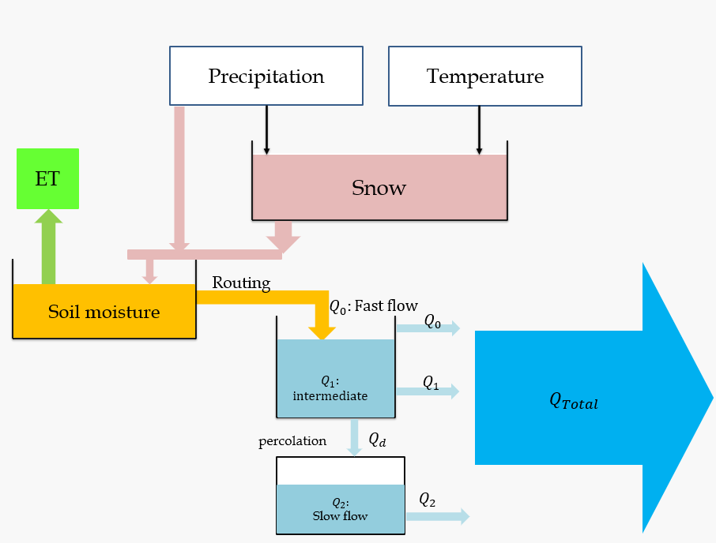

# Project Title:Package for hydrological modeling of river discharge
## Module:Python Programming for Water Resources Engineering and Research
### Authors:  
      1. Hedieh Beigi Pouya-3762109
      2. Mohammad Sharif Khaleqi-3638660
      3. Shunmuga Priya Subbiah-3703058

### github repository link
>  https://github.com/st191245/HBV--Package
### Project Description:

*<sub>Hydrological Process(source:sieker.de/en).</sub>*

>   ***Purpose*** : The project aims to implement a hydrological model for simulating river discharge based on various factors such as rainfall and snowfall,temperature,evapotranspiration and soil moisture storage.The project helps in understanding hydrological processes and their role in water resource management and flood forecasting. This model is important for understanding how water flows and is stored in nature, which helps in managing water resources, anticipating how environmental changes will affect water systems, and making informed decisions in areas related to water use and conservation. 

>   ***Motivation***: Hydrological models play a vital role in water resources engineering by enabling the accurate simulation of river discharge, which is crucial for effective water supply management, hydraulic structure design, and flood risk mitigation. This project implements an HBV-based model to enhance the understanding of catchment hydrology and provide a computational framework for predicting river water flow using meteorological data

>   ***Goals***: 
>  
> 1.Create a Python package for simulating river discharge.
>
> 2.Implement a simplified HBV hydrological model.
>
> 3.Enable logging and visualization for better analysis.
> 
> 

>  ## Project Description
> 
>  The primary goal of this project is to calculate the river discharge resulting form the rainfall and snow melt according to temperature excluding evapotranspiration and soil moisture storage. According to simple water balance equation(P = Q + ET + &#916;S). Where, P- precipitation, Q- runoff, ET- Evapotranspiration, and &#916;S- change in soil moisture storage.
>  
>
>  ### Concept:
>  The HBV model is a conceptual tool used to simulate how water flows through a river catchment. The key components of this model are precipitation, evapotranspiration, snowmelt, and soil moisture to predict streamflow. By using mathematical equations, it represents how water is stored and moves within the catchment.
>   

****Snow Module****: 
The model determines snow accumulation and melting based on temperature and precipitation. If the current temperature (T) is lower than the threshold temperature (TT), precipitation accumulates as snow. If T exceeds TT, snowmelt occurs, calculated as:

 lw =  𝑪𝒎𝒆𝒍𝒕∗ (𝑇𝑒𝑚𝑝𝑡 −𝑇), and Cmelt- the coefficient that determines snow melt per degree of temperature.
   
****ET Module****: 
The Evapotranspiration is the combined processes through which the water is transferred to the atomospher from open water and ice surfaces, bare soil, and vegetation on the earth surface. Evapotranspiration (ET) refers to the combined process of water evaporation from the soil and transpiration from plants. To calculate ET, we consider several factors including the previous soil moisture (𝑆𝑀𝑡−1), potential evapotranspiration (PE), and the permanent wilting point (𝒑𝒘𝒑). If the previous soil moisture is greater than the permanent wilting point, evapotranspiration occurs at its potential rate (𝐸𝑇𝑡 = 𝑃𝐸𝑡). However, if the soil moisture is less than or equal to the permanent wilting point, the actual evapotranspiration is proportional to the ratio of soil moisture to the wilting point and the potential evapotranspiration (𝐸𝑇𝑡 = 𝑆𝑀𝑡−1/𝒑𝒘𝒑 * 𝑃𝐸𝑡). This balance ensures that plants get the necessary water while accounting for soil moisture conditions.


****Soil Moisture Module****: 
The soil moisture module tracks the dynamics of soil moisture and groundwater outflow. It uses previous soil moisture (𝑠𝑚𝑡−1), outflow from the snow module (𝐿𝑊𝑡), evapotranspiration (𝐸𝑇𝑡), field capacity (𝑭𝑪), and a coefficient (𝜷).


1. Current Soil Moisture (𝑠𝑚𝑡):
* Current Soil Moisture (𝑠𝑚𝑡):
* Formula: SMt = max(0.0, SM - 1 + LWt * &#946;)

2. Final Soil Moisture:
* Adjusted for outflow to groundwater and evapotranspiration.
* Formula: SMt = max(0, SMt  1 + LWt  (Qb,t + ETt))

****Runoff Calculation****:

The surface runoff (Q) is computed using the following formula:
 
Q=k*S

where: 
- **Q**: Surface runoff in mm/day
- **k**: Runoff coefficient,a parameter that representing the efficiency of converting soil moisture into runoff 
- **S**: Soil moisture storage

## Code:
### Input Data:
The reference data used in this project is taken from catchment attributes and hydro-meteorological timeseries for 671 catchments across Great Britain (CAMELS-GB) dataset.
We have taken the CSV file for the catchment -12007 - Dee at Mar Lodge, Scotland(CAMELS_GB_hydromet_timeseries_12007.csv) 
which contains data from 01-10-1987 to 30-09-2015. 
The data file should contain the following columns:


| date | precipitation | peti | temperature | discharge_spec | discharge_vol |
|-----------------|:-------------:|:----:|:-----------:|:--------------:|:-------------:|
| 01/10/1987      |       0       | 0.93 |    7.91     |      1.54      |     5.205     |
| 02/10/1987      |       0       | 0.55 |    6.41     |      1.4       |     4.731     |
| .....           |      ...      |..|...|..|...|
 date(DD/MM/YYYY),precipitaion (mm/day),temperature(°C),specific discharge in mm/day, and discharge volume in m³/s for the necessary calculations 
for the project.The catchment area is 289 Km<sup>2</sup>.

source:https://nrfa.ceh.ac.uk/data/station/info/12007


### Usage Instructions:

1.Navigate to the project folder on your system:
Locate the folder(HBV) containing the project files and open a terminal or command prompt inside it.
(or)

clone the github repository here

>   git clone https://github.com/st191245/HBV_Project_final.git

2.Install required dependencies:
the required dependencies for this project are

- pandas

- numpy

- plotly

To install these, run:
>  pip install numpy pandas plotly

3.Run the main script main.py

4.Check the generated output files and plots for results.

## STRUCTURE:
   ### Keep the UML diagram here!!!!!!

## Docs of all functions incl. custom classes (actions, input arguments and output incl. data types)

### 1.Class DataReader

>  -__init__(csv_file_name, TT, Cmelt, SWE)
> 
> 

- From pandas:

- 1.df.Dataframe

-2.pd.read_csv

- 3.df.to_excel

- From Numpy:

- 1.np.max

- 2.np.min

-3. np.ptp

### Implimentation of Auxiliary components:

- 1.Creating the package with __init__ file

- 2.Class inheritance-Class Snow inherits Data Reader,Class Soilmoisture inherits Snow

- 3.Auto-create plots with plotly with dis-/enable boolean variable in main script

- 4.Logging actions, warnings, and errors in three types of logfile


## 1.user_config.py file

This file contains,

* Global library imports

*  File path definitions

* Model parameters for snow and soil moisture calculations

* Units and conversion factors

* Optional plotting configurations

 1.Global Library imports:

* The necessary python libraries for the HBV package are imported here.
>  * os and logging: For handling file paths and logging actions.
>  * numpy and pandas: For numerical computations and data manipulation.
>  * plotly: For visualization purposes.

If any required libraries are missing, appropriate error messages will be displayed.

2.File path definitions
 Paths for input and output files are specified here:

>  * CSV_FILE_NAME: The input hydrometeorological time series data file (default: CAMELS_GB_hydromet_timeseries_12007.csv).
>  * OUTPUT_FILE: The file for storing model outputs (default: runoff_with_discharge_output).

You can update these paths as required for your dataset and output preferences.


3.Model parameters for snow and soil moisture calculations
>  * These parameters are used in snowmelt calculations:

>   * TT: Threshold temperature for snow accumulation (default: 0 degrees Celsius).
>   * Cmelt: Melting coefficient (default: 15 mm/°C/day).
>   * SWE_INITIAL: Initial snow water equivalent (default: 0 mm).
>  * These parameters are used in runoff and soilmoisture  calculations:
>   * PWP: Permanent Wilting Point (default: 100 mm). 
>   * INITIAL_SOIL_MOISTURE: Initial soil moisture value (default: 10 mm). 
>   * FIELD_CAPACITY: Maximum water the soil can hold (default: 300 mm). 
>   * BETA: Shape parameter for runoff generation (default: 2). 
>   * K: Baseflow coefficient (default: 0.5). 
>   * TIME_STEP: Time step for model calculations (default: daily).

4.Units and Conversion Factors
 

To ensure consistancy in Units conversion.The following are used for discharge calculation  m3/s

>   * CATCHMENT_AREA: Area of the catchment (default: 289 * 1,000,000 m²). 
>   * mm_to_m: Conversion factor from millimeters to meters (default: 1 / 1000). 
>   * day_to_s: Conversion factor from days to seconds (default: 1 / (24 * 3600)).

5.Optional plotting configurations

>  * ENABLE_PLOTTING: Enables or disables visualization (default: True).

If enabled, results will be plotted using the plotly library and saved as interactive HTML files.

### Note:This User_config.py file is a critical component of the package and should not be deleted.
## 2.log_config.py
This log_config sets up a way to track messages about what's happening in the program by saving them into separate log files. 
The setup_logger function creates a log that records messages with details like the time and type of message (such as info, warnings, or errors). 
Three different logs are created: one for general actions, one for warnings, and one for errors. Each log saves messages in its own file. 
This helps keep everything organized and makes it easier to understand and fix any issues that might come up while the program is running.

```python
 from HBV_Core.User_config import *
```
Imports everything from User-config file,which contains logging import.
```python
 def setup_logger(name, log_file, level=logging.INFO):
```
This function sets up and returns a logger with specific properties:

1.name : The name of the loggers(actions,warning and error)

2.log_file: The file where log messages will be written (actions.log,warnings.log and errors.log)

3.level:The importance level of the messages to be logged (INFO or actions, WARNING, ERROR).
```python
handler = logging.FileHandler(log_file, encoding='utf-8')
```
The FileHandler ensures that all log messages are written to a file specified by log_file.
encoding='utf-8' ensures that text messages are written in UTF-8 format, supporting various characters.
```python
formatter = logging.Formatter('%(asctime)s - %(name)s - %(levelname)s - %(message)s')
```
Defines the format of the log messages:
- %(asctime)s: Adds a timestamp to each log message.
- %(name)s: The name of the logger(action,warning,error).
- %(levelname)s: The severity level (INFO, WARNING, ERROR).
- %(message)s: The actual log messages given at various blocks of the project.
```python
>handler.setFormatter(formatter)
```
Associates the formatter with the file handler, so all log messages written to the file follow the specified format
```python
logger = logging.getLogger(name)
logger.setLevel(level)
logger.addHandler(handler)
```
* logging.getLogger(name): Retrieves or creates a logger instance with the specified name.

* setLevel(level): Sets the minimum severity of messages this logger will handle.

* addHandler(handler): Attaches the file handler to the logger, enabling it to write to the specified log file.
```python
 return logger
```
The function returns the configured logger object for use in other parts of the program.
```python
action_logger = setup_logger('action', 'actions.log', logging.INFO)  # For general actions and information.
warning_logger = setup_logger('warning', 'warnings.log', logging.WARNING)  # For warning messages.
error_logger = setup_logger('error', 'errors.log', logging.ERROR)
```
The abovementioned lines create three separate loggers with different names, log levels, and log files.
- action_logger:Logs general actions or events at the INFO level to the file actions.log.
- warning_logger:Logs warning messages to the file warnings.log.
- error_loggre:Logs only error messages to the file errors.log.
## 3.Snow.py 
The following line import everything from user-config to Snow module.
>  from HBV.User_config import *
>
Then we will use (`__init__`) method
This (`__init__`) method initializes the DataReader class with the following key actions:

1.Sets the delimiter (`self.sep`) to the provided value or default (",")

2.Creates an empty pandas DataFrame (self.data_hbv)

3.Calls self.get_hbv_data() with the specified CSV file name to load data
    
```python
    def __init__(self, csv_file_name=CSV_FILE_NAME, delimiter=","):
        self.sep = delimiter
        self.data_hbv = pd.DataFrame()
        self.get_hbv_data(csv_file_name)
```
***get_hbv_data (method)***<br>

The `get_hbv_data`, is designed to load data from a CSV file into a Pandas DataFrame, handle errors during this process, and log the outcomes.
This method Takes the name of a CSV file (csv_file_name) as input.It uses the `pandas.read_csv` method to load the contents of the CSV file into a DataFrame
The method assumes that the file has a header row `(header=0)` and that fields in the file are separated by a specific delimiter `(sep=self.sep)`.
The `action_logger.info` in this code is used for logging a successful action.If the specified file does not exist, it logs an error message using `error_logger.error` and raises a `FileNotFoundError`.
The exception handling mechanism is designed to catch and handle any unexpected errors that may occur while attempting to load the CSV file.
This clause `except Exception as e`catches any exception that occurs during the execution of the try block, unless it was already caught by a more specific except clause earlier (like `FileNotFoundError`).
This `error_logger.error(f"An unexpected error occurred while loading data: {str(e)}")`logs an error message using `error_logger.error`.
```python
    def get_hbv_data(self, csv_file_name):
        try:
            self.data_hbv = pd.read_csv(csv_file_name, header=0, sep=self.sep)
            action_logger.info(f"Data loaded successfully from {csv_file_name}")
        except FileNotFoundError:
            error_logger.error(f"File not found: {csv_file_name}. Ensure the file exists at the specified path.")
            raise
        except Exception as e:
            error_logger.error(f"An unexpected error occurred while loading data: {str(e)}")
            raise
```

The following code block defines a function named drop_missing_data(),that removes rows with any missing values from the DataFrame.If the rows are sucessfully dropped,it will log a message.If any error occurs during the process it will log an error message.
the df.dropna() pandas function is used to drop the missing data from the Dataframe and inplace=True parameter is used to modify the DataFrame directly,and the dataframe data_hbv is updated by removing rows with missing values.
```python
    def drop_missing_data(self):
        
        try:
            self.data_hbv.dropna(inplace=True)
            action_logger.info("Dropped missing data successfully.")
        except Exception as e:
            error_logger.error(f"An unexpected error occurred while dropping missing data: {str(e)}")

```
The Snow class is initialized with the following parameters:
```python
class Snow(DataReader):
    def __init__(self, csv_file_name=CSV_FILE_NAME, TT=TT, Cmelt=Cmelt, SWE=SWE_INITIAL):
        super().__init__(csv_file_name)
        self.TT = TT
        self.Cmelt = Cmelt
        self.SWE = SWE
```
The following line of code logs an info-level message using the action_logger to record that the snow model has been successfully initialized. 
```python
        action_logger.info(f"Snow model initialized with TT={self.TT}, Cmelt={self.Cmelt}, SWE={self.SWE}")
```
***def calculate_snow_melt (method)***<br>
This method calculates the liquid water (meltwater) based on snow accumulation and melt processes, and appends a new "liquid_water" column to the dataset.
The function calculate_snow_melt returns the updated DataFrame self.data_hbv.
```python
    def calculate_snow_melt(self, ):
        return self.data_hbv
```
The code below checks if the required columns (temperature and precipitation) are present in the DataFrame (self.data_hbv).
If either column is missing:
Logs a warning message to highlight the issue.
Raises a `KeyError` to prevent further execution.
```python
        if 'temperature' not in self.data_hbv.columns or 'precipitation' not in self.data_hbv.columns:
            warning_logger.warning(
                "Missing columns: 'temperature' or 'precipitation'. Ensure the data contains these colums")
            raise KeyError("Required columns 'temperature' or 'precipitation' are missing from the DataFrame.")
```
Then the code initializes an empty list, `liquid_water_values=[]`, to store the calculated liquid water for each row of the DataFrame.
After that it loops through each row in the DataFrame using `iterrows()`and it extracts the temperature and precipitation values for the current time step.
```python
        liquid_water_values = []
        for _, row in self.data_hbv.iterrows():
            temperature = row["temperature"]
            precipitation = row["precipitation"]
```           
When the temperature is below the threshold temperature (TT), all precipitation is considered snow. Snowmelt Calculation:

Calculates the amount of snow that melts based on the formula:
`melt = self.Cmelt * (temperature - self.TT)`Here, `Cmelt` is a melt factor indicating how much snow melts per degree above the threshold.
Liquid Water Contribution:

Adds precipitation to the minimum of:
The amount of snow available for melting `self.SWE`, or
The calculated snowmelt `melt`.
This ensures that snowmelt does not exceed the available snow.
Update Snow Storage:
`self.SWE = np.max([0.0, self.SWE - melt])`.
Reduces the SWE by the amount of snowmelt `melt`, ensuring that SWE does not fall below 0.0.
For storing results,it appends the calculated liquid water for the current row to the liquid_water_values list
```python
             if temperature < self.TT:
                self.SWE += precipitation
                liquid_water = 0.0
            else:
                melt = self.Cmelt * (temperature - self.TT)
                liquid_water = precipitation + np.min([self.SWE, melt])  # np.min expects a list or array,this list compares two values and return the min value
                self.SWE = np.max([0.0, self.SWE - melt])  # np.max expects a list or array
            liquid_water_values.append(liquid_water)
```
After that it updates the Dataframe by adding a new column called `liquid_water`.
Then the line logs an info-level message using the action_logger.
It indicates that the snowmelt calculations have been successfully completed, which can be useful for tracking the program's execution and debugging.
Finally, it returns the Updated DataFrame.
```python
        self.data_hbv["liquid_water"] = liquid_water_values
        action_logger.info("Snow melt calculations completed successfully.")

        return self.data_hbv
```
The `__str__` method in the Snow class is designed to generate a simple, readable description of the model's current configuration by including its key parameters (TT, Cmelt, SWE). This makes the object more user-friendly when printed or logged.
```python
    def __str__(self):
        return f"Snow model with TT={self.TT}, Cmelt={self.Cmelt}, SWE={self.SWE}"
```
## 4.runoff.py
import the necessary components:

```python
from HBV_Core.Snow import Snow
from HBV_Core.User_config import *
from HBV_Core.log_config import *
```
The SoilMoisture class serves as a component of a hydrological model to calculate soil moisture dynamics within a catchment. It builds upon the snowmelt processes implemented in the parent Snow class and introduces additional attributes and parameters specific to soil moisture modeling.
```python
class SoilMoisture(Snow):
    def __init__(self, csv_file_name=CSV_FILE_NAME, beta=BETA, TT=TT, Cmelt=Cmelt, SWE=SWE_INITIAL,mm_to_m=mm_to_m,day_to_s=day_to_s,Area= CATCHMENT_AREA, initial_soil_moisture=INITIAL_SOIL_MOISTURE, FC=FIELD_CAPACITY, pwp=PWP):
        super().__init__(csv_file_name, TT, Cmelt, SWE)
        self.beta = beta
        self.k = K
        self.timeStep = TIME_STEP
        self.initial_soil_moisture = INITIAL_SOIL_MOISTURE
        self.FC = FC
        self.pwp = PWP
        self.Area = CATCHMENT_AREA
        self.mm_to_m=mm_to_m
        self.day_to_s=day_to_s
        self.processed_data= None
```
The SoilMoisture class inherits from the `Snow` class.
It calls the parent class’s constructor `(super().__init__)` to initialize parameters related to snowmelt, such as csv_file_name, TT, Cmelt, and SWE.
```python
class SoilMoisture(Snow):
    def __init__(self, csv_file_name=CSV_FILE_NAME, beta=BETA, TT=TT, Cmelt=Cmelt, SWE=SWE_INITIAL,mm_to_m=mm_to_m,day_to_s=day_to_s,Area= CATCHMENT_AREA, initial_soil_moisture=INITIAL_SOIL_MOISTURE, FC=FIELD_CAPACITY, pwp=PWP):
        super().__init__(csv_file_name, TT, Cmelt, SWE)
        self.beta = beta
        self.k = K
        self.timeStep = TIME_STEP
        self.initial_soil_moisture = INITIAL_SOIL_MOISTURE
        self.FC = FC
        self.pwp = PWP
        self.Area = CATCHMENT_AREA
        self.mm_to_m=mm_to_m
        self.day_to_s=day_to_s
        self.processed_data= None
```
is logging an info-level message that provides information about the initialization of the SoilMoisture model.
```python
        action_logger.info(
            f"SoilMoisture model initialized with beta={self.beta}, k={self.k}, timeStep={self.timeStep}")
```
The `calculate_ET_and_soil_moisture` method computes soil moisture, evapotranspiration (ET), and runoff over a series of time steps using hydrological principles. The calculations are applied to data stored in a DataFrame `self.data_hbv` where each row represents a time step.
The method first checks if the columns `liquid_water` and `peti` exist in the input DataFrame `self.data_hbv`.
```python
        if 'liquid_water' not in self.data_hbv.columns or 'peti' not in self.data_hbv.columns:
            error_logger.error("Required columns 'liquid_water' or 'peti' are missing from the DataFrame.")
            raise KeyError("Required columns 'liquid_water' or 'peti' are missing from the DataFrame.")
```
Three empty lists are created to store the calculated values for soil moisture, runoff, and ET (evapotranspiration) for each time step.
```python
        soil_moisture = []
        runoff = []
        et_values = []
```
The code then loops through the rows of self.data_hbv using the `iterrows()` function, which returns the index and data of each row.`liquid_water` (precipitation or snowmelt) and `peti` (potential evapotranspiration) are extracted from the current row.
```python
        for index, row in self.data_hbv.iterrows():
            liquid_water = row['liquid_water']
            peti = row['peti']
```
First Iteration (index == 0):
For the first row (index 0), the soil moisture is initialized to self.initial_soil_moisture (a predefined value).
q_new represents runoff, which is calculated as self.k * s_new. Here, self.k is a coefficient, and s_new is the current soil moisture.
The evapotranspiration (ET) is calculated based on the ratio of soil moisture to field capacity (self.FC), scaled by the potential evapotranspiration (peti). If the soil moisture is less than the permanent wilting point (self.pwp), the evapotranspiration is calculated as (s_new / self.FC) * peti; otherwise, ET is set equal to peti.
```python
            if index == 0:
                s_new = self.initial_soil_moisture
                q_new = self.k * s_new
                et = (s_new / self.FC) * peti if s_new < self.pwp else peti
```
Subsequent Iterations (index > 0):
For each row after the first (where index > 0), the calculations are updated based on the previous row’s results.
Inflow: This is the liquid_water for the current row.
Outflow: The outflow is calculated as the sum of the previous runoff (runoff[-1]) and the previous evapotranspiration (et_values[-1]).
Soil moisture `sm_t`: The new soil moisture is calculated by adding the inflow (precipitation/snowmelt) and subtracting the outflow (runoff and ET). The value is constrained to be non-negative using max(0, ...).
Runoff `qb_t`: The potential runoff is calculated using the formula `qb_t = liquid_water * ((sm_t / self.FC) ** self.beta)`. The value is scaled based on the current soil moisture compared to the field capacity, raised to the power of self.beta.
New soil moisture `s_new`: The new soil moisture is calculated by subtracting the runoff and evapotranspiration from the previous soil moisture. The value is constrained to be non-negative using max(0.0, ...).
Evapotranspiration (ET): Similar to the first iteration, ET is calculated based on the ratio of soil moisture to field capacity `self.FC`, scaled by the potential evapotranspiration `peti`. If soil moisture is less than the permanent wilting point (self.pwp), the evapotranspiration is calculated; otherwise, it is set to `peti`.
```python
            else:
                inflow = liquid_water
                outflow = runoff[-1] + et_values[-1]
                sm_t = max(0, soil_moisture[-1] + inflow - outflow)
                qb_t = liquid_water * ((sm_t / self.FC) ** self.beta)
                s_new = max(0.0, soil_moisture[-1] + inflow - qb_t - et_values[-1])
                q_new = qb_t
                et = (s_new / self.FC) * peti if s_new < self.pwp else peti
```
For each iteration, the calculated values for soil moisture, runoff, and ET are appended to their respective lists (soil_moisture, runoff, et_values).
```python
            soil_moisture.append(s_new)
            runoff.append(q_new)
            et_values.append(et)
```
Update DataFrame with New Calculations:
```python
        self.data_hbv["Simulated_Runoff"] = runoff
        self.data_hbv["Soil_moisture"] = soil_moisture
        self.data_hbv["ET"] = et_values
```
An info-level log message is generated to indicate that the ET and soil moisture calculations have been successfully completed.
```python
        action_logger.info("ET and soil moisture calculations completed successfully.")
```
Finally, the method returns the updated self.data_hbv DataFrame, which now includes the newly calculated columns for simulated runoff, soil moisture, and evapotranspiration.
```python
return self.data_hbv
```
The method is a special method in Python that is used to define the string representation of an object. It allows you to specify what a SoilMoisture object will display when you use print() or str() on the object.
```python
    def __str__(self):
        return f"SoilMoisture model with beta={self.beta}, k={self.k}, timeStep={self.timeStep}"
```
This code defines the volume_discharge method, which calculates the discharge volume for each time step based on the simulated runoff data.The updated self.data_hbv DataFrame is returned.
```python
    def volume_discharge(self):

        return self.data_hbv
```
A list named `discharge_volume_simulated` is initialized. This list will store the calculated discharge volume for each time step in the dataset.
The following code iterates through each row of the self.data_hbv DataFrame, which is assumed to contain hydrological data.
```python
        for index, row in self.data_hbv.iterrows():
            simulated_runoff = row['Simulated_Runoff']  # Accessing simulated runoff for the current row
```
For each row in the DataFrame, the code converts the simulated runoff (Simulated_Runoff in mm/day) to discharge volume (m³/s).
The calculated discharge volume for each row is appended to the list `discharge_volume_simulated`.
A new column, `Discharge_Vol_simulated`, is added to the DataFrame to store the discharge volumes for all time steps.
The range (difference between max and min) of the discharge volumes is logged for tracking and debugging purposes.
```python
            discharge_volume = simulated_runoff * self.mm_to_m * self.Area * self.day_to_s

            discharge_volume_simulated.append(discharge_volume)

        # You can store the discharge values back in the DataFrame or return them
        self.data_hbv["Discharge_Vol_simulated"] = discharge_volume_simulated
        action_logger.info(f"Range of discharge volume calculated: {np.ptp(discharge_volume_simulated)}")
```
The following  code saves the final pandas DataFrame (self.data_hbv) to an Excel file named "Data_with_discharge_simulated_output.xlsx" using the to_excel() method. 
The index=False parameter ensures that the DataFrame's index is not included in the file. After saving, it prints a confirmation message to inform the user that the file has been successfully created.

```python
        output_file = "HBV/Data_with_discharge_simulated_output.xlsx"
self.data_hbv.to_excel(output_file, index=False)
print(f"DataFrame with discharge volume has been saved to {output_file}")
```
## 5.visualization.py

This module defines a function create_plots that generates and displays interactive scatter plots comparing simulated and observed discharge volumes over time.
It takes a DataFrame (data_hbv) containing date and discharge volume data, creates two scatter plots (one for simulated discharge and one for observed discharge), and displays them with labels and a range slider for zooming. 
The plot is then saved as an interactive HTML file for future reference. Additionally, the function logs the process of creating and displaying the plots
The detailed explanation of the code below:

```python
from HBV_Core.User_config import *
```
imports everything from config.py.
```python
 def create_plots(data_hbv):
```

Defines the create_plots function that is given data_hbv as input, which is a DataFrame  containing the processed data for discharge volume and other variables
```python
 scatter_plots = [
    go.Scatter(
        x=data_hbv["date"],
        y=data_hbv["Discharge_Vol_simulated"],
        mode="lines+markers",
        name="Discharge_Vol_simulated",
        line=dict(color="blue"),
    ),
    go.Scatter(
        x=data_hbv["date"],
        y=data_hbv["discharge_vol"],
        mode="lines+markers",
        name="Discharge Volume Observed",
        line=dict(color="orange"),
    ), ]
```
Here, we are creating two scatter plots using Plotly's go.Scatter:

- The first scatter plot shows the simulated discharge volume, where:
  * x=data_hbv["date"]: Dates are plotted along the x-axis
  * y=data_hbv["Discharge_Vol_simulated"]: Simulated discharge volumes are plotted along the y-axis.
  * mode="lines+markers": This specifies that both lines and markers (dots) should be displayed.
  * name="Discharge_Vol_simulated": This name appears in the plot’s legend.
  * line=dict(color="blue"): The line color is set to blue

- The second scatter plot is the same, but it represents the observed discharge volume.
  * y=data_hbv["discharge_vol"]: Observed discharge values are plotted along the y-axis taken from the dataframe.
  * line=dict(color="orange"): The line color is set to orange.
  * name=["Discharge Volume Observed"]: This name appears in the plot’s legend.
```python
  action_logger.info("Scatter plots for discharge volume created successfully.")
```
This logs the message that the scatter plots for the discharge volume have been created successfully.
```python
fig = go.Figure(data=scatter_plots)
```
Creates a figure object fig that contains the scatter plots.
```python
> fig.update_layout(
    title='Discharge Volume: Simulated vs Observed',
    xaxis_title='Date',
    yaxis_title='Discharge Volume in m3/s',
    legend_title='Runoff Type',
    xaxis=dict(rangeslider=dict(visible=True)),  # Adding the range slider for zooming
)
```
Updates the layout of the figure with:

- Title:  The overall plot is titled "Discharge Volume: Simulated vs Observed."

- X-axis title: "Date"

- Y-axis title: "Discharge Volume in m³/s"

- Legend title: The legend is labeled as "Runoff Type" to indicate that the two lines represent different types of runoff (Simulated vs Observed).

- A range slider for zooming on the X-axis
```python
 action_logger.info("Figure layout updated with titles and range slider.")
 ```
This logs the message that the layout has been updated successfully with titles and the range slider, indicating that the plot is being prepared for display.
```python
 fig.show()
```
Displays the plot in an interactive window or notebook.
The plot will include both simulated and observed discharge volume as scatter plots, with interactive features like zooming.
```python
pyo.init_notebook_mode()
pyo.iplot(fig, filename='discharge_volume_simulation.html')
```
pyo.init_notebook_mode(): This initializes the Plotly notebook mode, ensuring that the plot is displayed within a notebook (if applicable)

pyo.iplot(fig, filename='discharge_volume_simulation.html'): This saves the plot as an interactive HTML file. The filename argument specifies the name of the saved file (in this case, discharge_volume_simulation.html).
```python
  return fig
```
Returns the fig object.

## 6.Main.py

This module defines the main function that orchestrates the runoff modeling process. It first initializes the SoilMoisture object and loads the necessary data. 
Then, it performs a series of calculations: snowmelt, evapotranspiration (ET), soil moisture, and discharge volume. If plotting is enabled, it generates and displays plots comparing simulated and observed discharge volumes. Throughout the process, actions are logged, and if an error occurs, 
it is logged and re-raised. The main() function is executed if the script is run directly.Explanation of the code below:

```python
  from HBV_Core.runoff import SoilMoisture
from HBV_Core.User_config import *
from HBV_Core.visualization import *
from HBV_Core.log_config import *
```

These import statements bring in the necessary modules and functions from the HBV package. SoilMoisture class is imported 
from HBV.runoff, configurations and global variables from HBV.User_config, and plotting functions from HBV.visualization.And necessary logging configurations
from HBV.log_config.
```python
  def main(): 
```
function defines the primary logic of the code.
```python
 action_logger.info("Starting the main process for runoff modeling.")
```
This line logs the start of the main process using the action_logger. This would be recorded in the log file as an informational message, helping the user track the flow of the program.
```python
   runoff = SoilMoisture(CSV_FILE_NAME)
   action_logger.info("SoilMoisture object initialized.")
```

This line creates an instance of the SoilMoisture class using the CSV_FILE_NAME to initialize it. The SoilMoisture class
is responsible for the calculation of  soil moisture and runoff.The next line is for the actions logging.
```python
   runoff.get_hbv_data(CSV_FILE_NAME)
```
This calls the get_hbv_data method on the runoff object, which reads and processes the HBV data from the CSV file 
specified by CSV_FILE_NAME.
```python
  runoff.calculate_snow_melt()
```
This calls the calculate_snow_melt method to compute the amount of snowmelt and liquid water based on the input data.
```python
    runoff.calculate_ET_and_soil_moisture()
```
This calls the calculate_ET_and_soil_moisture method, which calculates the evapotranspiration (ET) and updates the 
soil moisture levels based on the processed data.
 ```python 
   runoff.volume_discharge()
```
This calls the volume_discharge method to compute the discharge volume in m<sup>3</sup>/s using the 
runoff (specific discharge in mm/day) and other hydrological data.
```python
   processed_data = runoff.data_hbv
```
The line  extracts this data from the runoff object and assigns it to a local variable named  processed_data.
```python
        if ENABLE_PLOTTING:
        action_logger.info("Plotting is enabled. Generating plots.")
        create_plots(processed_data)
```
It checks if plotting is enabled by evaluating the ENABLE_PLOTTING variable.If ENABLE_PLOTTING is set to True, 
it calls the create_plots function from the HBV.visualization module.The logger records that plotting is enabled and it indicates that the system is going to generate plots,then the create plots
function is called.The create_plots function is given processed_data as an argument, which contains the processed data to generate plots for data visualization.
```python
   action_logger.info("Runoff modeling process completed successfully.")
```
This logs the successful completion of the entire modeling process. It marks the end of the program and is recorded as an informational log.
```python
       except Exception as e:
        error_logger.error(f"An unexpected error occurred in the main process: {str(e)}")
        raise
```
This block catches any unexpected errors or exceptions that occur during the execution of the main() function.If an error occurs, 
it is logged using the error_logger, which would record the error details in a dedicated log file for errors.After logging the error, the exception is re-raised using the raise statement. This allows 
the error to propagate and stop the execution of the program, ensuring that no incomplete or corrupted data is processed.

```python
  
if __name__ == "__main__":
    main()
```
The condition if __name__ == "__main__": checks if the script is being executed as the main program.
If the condition is true, it calls the main() function to execute the main logic of the program.

When the program finish running,the plots are created as interactive HTML files, allowing you to visualize the data 
through a web browser or other compatible viewer.

### Results:


Based on our model calculations, we have determined the simulated runoff. The output csv file  contains all the calculated values appended to the dataframe. The graph below compares the simulated runoff and observed runoff shows the final output.


