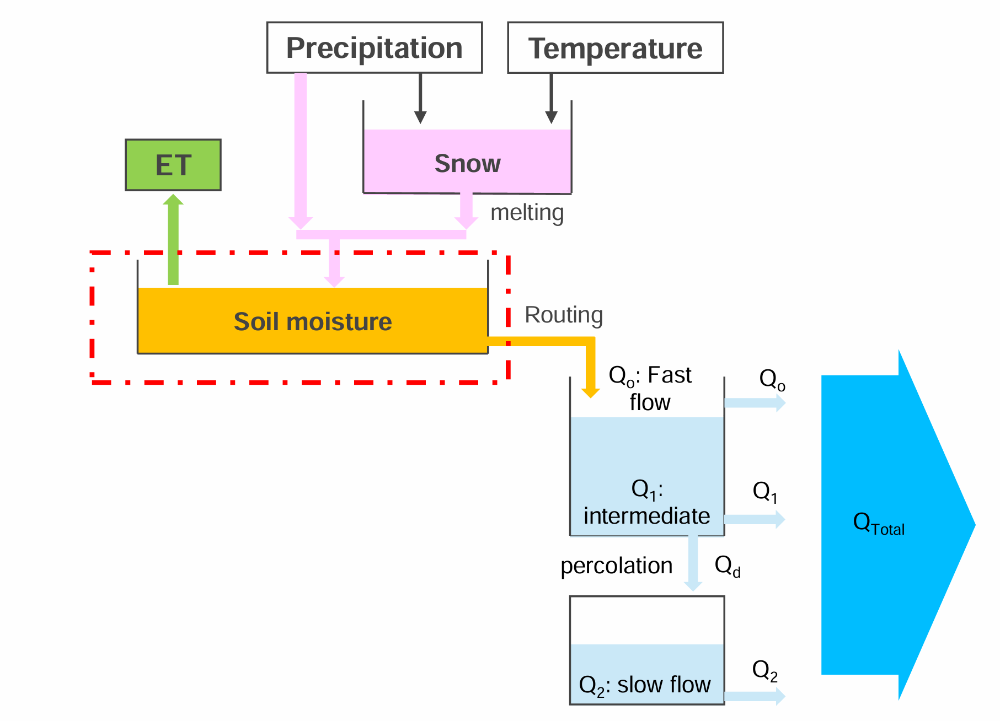
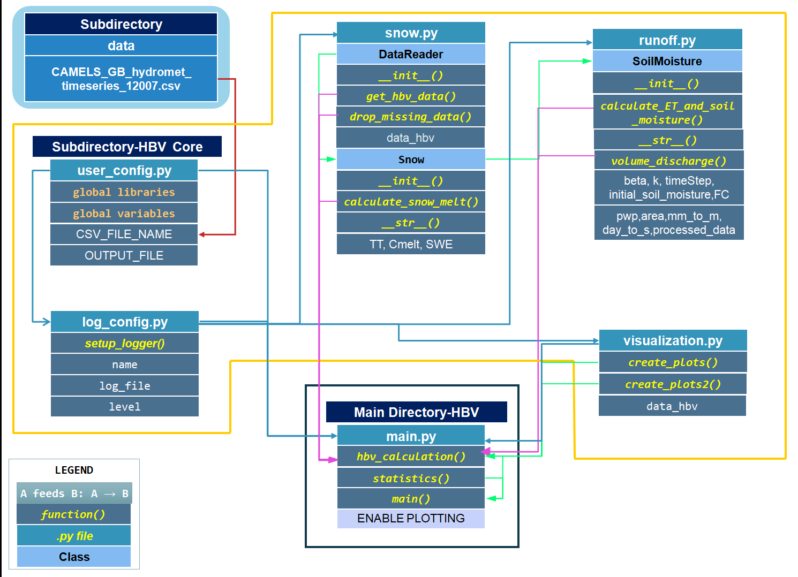

# Package for Hydrological Modeling of River Discharge

***

## Table of Contents:

1. [Project purpose/description](#Project-purposedescription)
2. [Motivation](#Motivation)
3. [Goal](#Goal)
4. [Theory behind HBV Modeling](#Theory)
5. [Package requirements](#Package-requirements)
6. [Code Overview](#code-overview)
7. [UML](#Code-Diagram)
8. [Installation and run a project](#Installation-and-running-a-project)

***

### Authors:  BKS
      1. Shunmuga Priya Subbiah-3703058
      2. Hedieh Beigi Pouya-3762109
      3. Mohammad Sharif Khaleqi-3638660
     

## Project purpose/description 

The project aims to implement a hydrological model for simulating river discharge based on various factors such as rainfall and snowfall,temperature,evapotranspiration and soil moisture storage.The project helps in understanding hydrological processes and their role in water resource management and flood forecasting. This model is important for understanding water flows and how it is stored in nature, which helps in managing water resources, anticipating how environmental changes will affect water systems, and making informed decisions in areas related to water use and conservation. 
***
## Motivation
Hydrological models play a vital role in water resources engineering by enabling the approximate simulation of river discharge, which is crucial for effective water supply management, hydraulic structure design, and flood risk mitigation. This project implements an HBV-based model to enhance the understanding of catchment hydrology and provide a computational framework for predicting river water flow using meteorological data
***
## Goal
 * Create a Python package for simulating river discharge.

 * Implement a simplified HBV hydrological model.

 * Enable logging and visualization for better analysis.

The full package is available in: **GitHub Repository URL**
```
https://github.com/st191245/HBV_Project_final.git
```
***
## Theory
The primary goal of this project is to calculate the river discharge resulting form the rainfall and snow melt according to temperature considering evapotranspiration and soil moisture storage. According to simple water balance equation

$$ P = Q + ET + \Delta S^{[3]} $$

Where,
* $P$- precipitation
* $Q$- runoff
* $ET$- Evapotranspiration
* $&#916;S$- change in soil moisture storage.

The HBV approach basically contains 3 modules.They are

#### 1. Snow Module

The model determines snow accumulation and melting based on temperature and precipitation. If the current temperature `T` is lower than the threshold temperature `TT`, precipitation accumulates as snow. If `T` exceeds `TT`, snowmelt occurs, calculated as:

$$ \text{liquid water} = C_{\text{melt}} \cdot (T - TT)^{[3]} $$

where,
   *  $C_{\text{melt}}$ - the coefficient that determines snow melt per degree of temperature


#### 2. Evapo Transpiration(ET) Module

Evapotranspiration (ET) refers to the combined process of water evaporation from the soil and transpiration from plants. To calculate ET, this project considered several factors including the  soil moisture , potential evapotranspiration 𝒑et, and the permanent wilting point (𝒑𝒘𝒑). If the previous soil moisture is greater than the permanent wilting point, evapotranspiration occurs at its potential rate:

$$ ET_t = PE_t^{[3]} $$

However, if the soil moisture is less than or equal to the permanent wilting point, the actual evapotranspiration is proportional to the ratio of soil moisture to the wilting point and the potential evapotranspiration:

$$ ET_t = \frac{SM_{t-1}}{pwp} \cdot PE_t^{[3]} $$

This balance ensures that plants get the necessary water while accounting for soil moisture conditions.

#### 3. Soil Moisture Module

The soil moisture module tracks the dynamics of soil moisture and groundwater outflow. It uses previous soil moisture ($SM_{t-1}$), outflow from the snow module ($LW_t$), evapotranspiration ($ET_t$), field capacity ($FC$), and a coefficient ($\beta$).
   
i. Current Soil Moisture ($SM_t$):
* Current Soil Moisture ($SM_t$):
* Formula: 

$$ SM_t = \max(0.0, SM - 1 + LW_t \cdot \beta)^{[3]} $$


ii. Final Soil Moisture:
* Adjusted for outflow to groundwater and evapotranspiration.
* Formula:
  
$$ SM_t = \max(0, SM_{t-1} + LW_t \cdot (Q_{b,t} + ET_t))^{[3]} $$


#### 4. Runoff Calculation

The surface runoff ($Q$) is computed using the following formula:
 
$$ Q = k \cdot S^{[3]} $$


where: 
- **$Q$**- Surface runoff in mm/day
- **$k$**- a coefficient that representing the efficiency of converting soil moisture into runoff 
- **$S$**- Soil moisture storage
  
  
  Source:Lecture notes-Integrated Watershed Modelling

  
***
## Package requirements
To run this project successfully, the following dependencies are required:
1. **Python**: Version 3.11 or higher.
2. **Libraries/Modules**:
*    `pandas`
*    `numpy`
*    `plotly.graph_objects`
*    `plotly.offline`
*    `os`
*    `logging`
Note: * The versions of the required libraries are included in a text file within this folder. This text file lists the specific versions of each library that are necessary for the proper execution of this project.
      *This project was designed and written on a Windows machine. If you are running this code on a Windows system, the current configurations and dependencies should work as expected. However, if you plan to use this project on a Linux machine, please be aware that certain configurations (such as file paths, system-specific libraries, or environment settings) may need to be adjusted.
### Input data
The reference data used in this project is sourced from catchment attributes and hydro-meteorological time series for 671 catchments across Great Britain, provided by the CAMELS-GB dataset.

The CSV file for the catchment **12007 - Dee at Mar Lodge, Scotland**`CAMELS_GB_hydromet_timeseries_12007.csv`is used in this project. This file contains data from **01-10-1987** to **30-09-2015**.

Note:The data file should contain the following columns for the input of the project:


| date | precipitation | peti | temperature | discharge_spec | discharge_vol |
|-----------------|:-------------:|:----:|:-----------:|:--------------:|:-------------:|
| 01/10/1987      |       0       | 0.93 |    7.91     |      1.54      |     5.205     |
| 02/10/1987      |       0       | 0.55 |    6.41     |      1.4       |     4.731     |
| .....           |      ...      |..|...|..|...|

Note: date(DD/MM/YYYY), precipitaion (mm/day), temperature(°C), specific discharge in (mm/day), and discharge volume in (m³/s) for the necessary calculations 
for the project. The catchment area is 289 km<sup>2</sup>.

***
## Code Overview
The object-oriented code utilizes custom classes, which are referenced within a main.py script to calculate runoff resulting from precipitation based on provided inputs. The code structure is built upon custom classes and functions defined in the following package.
The HBV_Core package contains,

**1. user_config.py**
* Library Imports: Loads essential Python libraries (numpy, pandas, plotly) for data handling and visualization.
* File Paths: Defines paths for input `CSV_FILE_NAME` and output `OUTPUT_FILE` data files.
* Snow Parameters: Sets values for threshold temperature `TT`, melting coefficient `Cmelt`, and initial snow water equivalent `SWE_INITIAL`.
* Evapotranspiration Parameters: Specifies soil moisture limits, including Permanent Wilting Point `PWP`, initial soil moisture, and field capacity.
* Soil Moisture Parameters: Includes key hydrological coefficients `BETA`, `K` and time step `TIME_STEP`.The time step mentioned here is 1 day.
* Catchment Properties: Defines catchment area `CATCHMENT_AREA` and unit conversion factors `mm_to_m`, `day_to_s`.
* Plotting Option: A toggle `ENABLE_PLOTTING` to enable or disable visualization. 

<p align="center">- - - - - - - - - - - - - - - - - - - -</p>

**2. log_config.py**

This file contains a function `setup_logger()` which,Sets up a logger to log messages to a specified log file with the given logging level.
This function creates a logger object with a file handler, sets the logging level,
and attaches a formatter to structure the log messages.This will create 3 logfiles such as actions.log,warnings.log,errors.log.These log files stores all
the logged messages.
<p align="center">- - - - - - - - - - - - - - - - - - - -</p>

**3. snow.py** 

This file contains two classes:

3.1. `DataReader`-This class is responsible for loading and handling HBV model data.It has 3 functions.
   
3.1.1.`__init__`  (csv_file_name, delimiter)- Initializes the object, sets the delimiter, and loads data from the specified CSV file
 
3.1.2.`get_hbv_data(csv_file_name)`- Reads HBV model data into a Pandas DataFrame, handling errors and logging actions.

3.3.3.`drop_missing_data()` - Removes rows with missing values from the dataset and logs the action.

3.2. Snow: This class inherits from `DataReader`, Models snow accumulation and melting.This class is also contain 3 functions:

3.2.1.`__init__(csv_file_name, TT, Cmelt, SWE)` -Initializes the snow model with threshold temperature `TT`, melting coefficient `Cmelt`, and initial Snow Water Equivalent `SWE`.

3.2.2.`calculate_snow_melt()`- Simulates snow accumulation and melting based on temperature and precipitation data.
* This method uses TT and Cmelt to compute liquid water.
* Updates SWE after melting.

3.2.3.`__str__()` - Returns a string summary of the snow model parameters (`TT`,`Cmelt`, and `SWE`).

<p align="center">- - - - - - - - - - - - - - - - - - - -</p>

**4. runoff.py** 
   
This file contains one class,SoilMoisture which inherits class Snow.It models soil moisture, evapotranspiration, and runoff processes.This Class contains 4 methods.

4.1. ` ___init__(csv_file_name, beta, TT, Cmelt, SWE, mm_to_m, day_to_s, Area, initial_soil_moisture, FC, pwp)`-
Initializes the soil moisture model with parameters for soil properties, evapotranspiration, and runoff.

4.2.`simulation()` -This function models the hydrological processes of soil moisture, runoff, and evapotranspiration (ET) over time. It calculates these values for each time step, starting with initial conditions and using previous values for subsequent steps. The function returns three lists containing the calculated values for soil moisture, runoff, and ET throughout the simulation period.

4.3.`calculate_runoff()` -Computes evapotranspiration (ET), soil moisture, and runoff for each time step.
Uses beta, field capacity (FC), and permanent wilting point (PWP) to update moisture balance.
Updates the dataset with calculated Simulated_Runoff, Soil_moisture, and ET values.

4.4.`__str__()` -
Returns a string summary of the soil moisture model parameters (beta, k, and timeStep).

4.5.`volume_discharge()` -This function computes the discharge volume (m³/s) from simulated runoff which will be in(mm/day) using catchment area and time conversion factors.
Stores the results in Discharge_Vol_simulated column and Saves the updated dataframe to an output file (Data_with_discharge_simulated_output1.csv) for further analysis and record-keeping.
<p align="center">- - - - - - - - - - - - - - - - - - - -</p>

**5. visualization.py**

This file contains two functions, `create_plots()` and `create_plots2()`, which generate interactive scatter plots using Plotly to visualize hydrological data. These functions help in analyzing the simulated and observed discharge volumes as well as soil moisture and precipitation trends over time.
Both functions utilize Plotly for dynamic visualization and include logging to track their execution status.
<p align="center">- - - - - - - - - - - - - - - - - - - -</p>

#### main.py file Overview: Executing HBV Modeling
The main.py file accesses the `HBV_Core` package to execute the HBV hydrological modeling process.It has 3 functions.

1.`hbv_calculation()`-  This function is responsible for executing the entire runoff modeling process using the HBV hydrological model. It begins by initializing a `SoilMoisture` object with the provided CSV file, which contains the necessary hydrometeorological data. The function then sequentially processes the data by loading it, removing missing values, calculating snowmelt, simulating the necessary parameters and estimating runoff, and computing the discharge volume. The processed data is stored in the data_hbv attribute of the runoff object. If plotting is enabled, it generates visualizations to compare simulated and observed values as first plot, Precipitation and SoilMoisture values as second plot. Throughout the process, logging is used to track execution steps and handle any unexpected errors. Finally, the processed dataset is returned for further analysis.

2.`statistics(processed_data)`-This function looks at runoff data and calculates the average and standard deviation for key variables like precipitation, simulated discharge, and observed discharge. This helps to see how the model's results compare to actual data, making it easier to understand and improve the model.

3.`main()`-This function serves as the entry point for the runoff modeling process. It first calls `hbv_calculation()` to process hydrological data, including snowmelt, evapotranspiration, soil moisture, and discharge volume calculations. Once the data is processed, it passes the results to the `statistics()` function, which analyzes key metrics like mean and standard deviation. This function ensures the complete execution of the model and statistical evaluation in a structured manner.

## UML
>   
## Installation and run a project

To install the required libraries, run:
```
pip install numpy pandas plotly os logging
```
Upon meeting software requirements and getting the input python file in the local device, run the main script
```
python main.py
```
to get output file and plots for results.
The Generated output files would be,

 1. Data_with_discharge_simulated_output.csv file with updated data frame columns will look like,


| date | precipitation | peti | temperature | discharge_spec | discharge_vol | liquid_water | Simulated_Runoff | Soil_moisture | ET            | Discharge_Vol_simulated |
|-----------------|:-------------:|:----:|:-----------:|:--------------:|:-------------:|-----------|------|:--------------|---------------|-------------------------|
| 01/10/1987      |       0       | 0.93 |    7.91     |      1.54      |     5.205     |0  | 5    | 10            | 0.031 |  16.724                 |
| 02/10/1987      |       0       | 0.55 |    6.41     |      1.4       |     4.731     | 0| 0    | 9.969         | 0.018         | 0                       |
| .....           |      ...      |..|...|..|...|..| ...  | ...           | ...           | ..                      |

2. Enabled plots as interactive html files:
        
* Discharge Volume: Simulated vs Observed

* Soil_Moisture and Precipitation
   

## References:
1.*Bergström, S., & Forsman, A. (1973). Development of a conceptual deterministic rainfall-runoff model. Nord. Hydrol, 4, 240-253.*

2.*https://nrfa.ceh.ac.uk/data/station/info/12007*

3.*Lecture notes-Integrated Watershed Modelling*

4.*Nguyen, P. S., Nguyen, T. H., & Nguyen, T. H. (2024). A real‐time flood forecasting hybrid machine learning hydrological model for Krong H'nang hydropower reservoir. River, 3(1), 107-117.*


